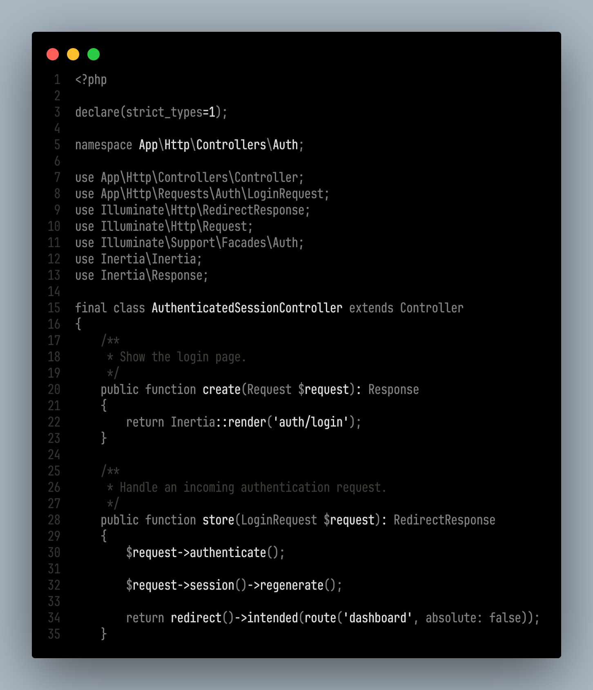

# True Monochrome Theme

A clean, distraction-free VS Code theme featuring true monochrome styling for optimal focus and readability.

## Features

- **Pure Monochrome Design**: True black and white color scheme with subtle grays
- **High Contrast**: Optimized for maximum readability and reduced eye strain
- **Minimalist Approach**: No colors, just shades of gray for a distraction-free experience
- **Optimized Syntax Highlighting**: Careful use of weight and style to differentiate syntax elements
- **Wide Language Support**: Comprehensive support for all major programming languages

## Installation

1. Open VS Code
2. Go to Extensions (Ctrl+Shift+X / Cmd+Shift+X)
3. Search for "True Monochrome Theme"
4. Click Install

## Usage

### Activating the Theme
1. Open Command Palette (Ctrl+Shift+P / Cmd+Shift+P)
2. Type "Preferences: Color Theme"
3. Select "True Monochrome"

## Screenshot

## Features in Detail

- **True Monochrome**: No colors, just pure black, white, and grayscale
- **Optimized Contrast**: Careful selection of grays for maximum readability
- **Reduced Eye Strain**: Designed for long coding sessions
- **Minimalist Design**: Focus on content without visual distractions
- **Wide Language Support**: Comprehensive syntax highlighting for all major languages

## Contributing

Found a bug or want to suggest an improvement? Please:
1. Check existing issues first
2. Create a new issue with detailed description
3. Include screenshots if relevant

## Changelog

See [CHANGELOG.md](CHANGELOG.md) for release history.

## License

MIT License - see [LICENSE](LICENSE) for details.